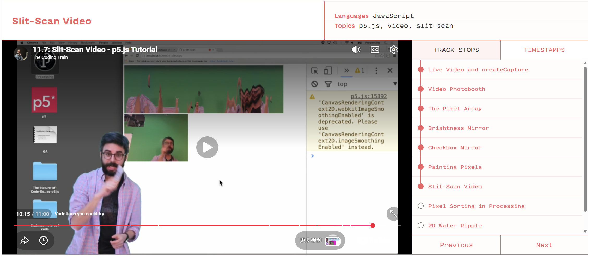
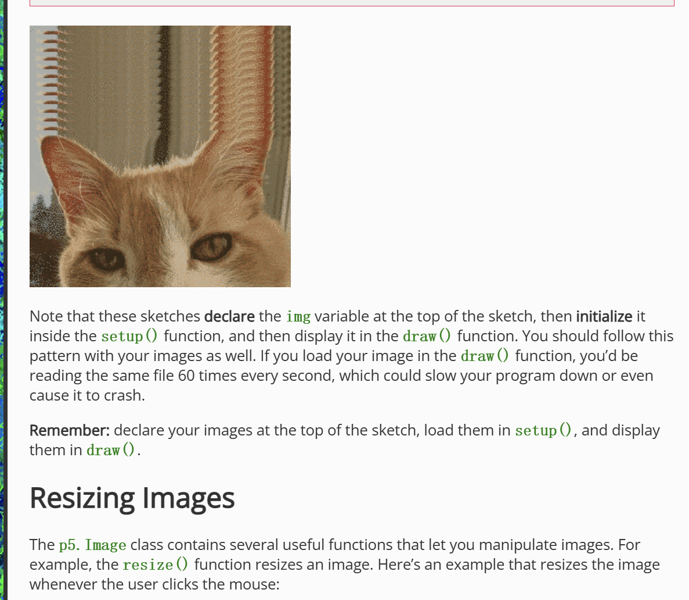
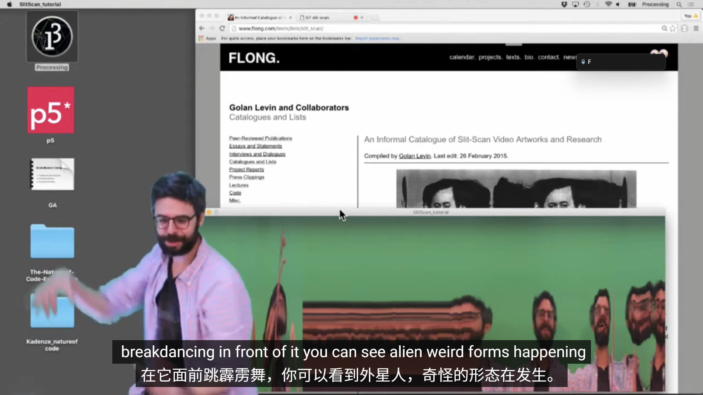

# Quiz 8

## Part 1: Imaging Technique Inspiration

### Imaging Technique: Slit-scan Visual Effect

For my inspiration, I chose the slit-scan visual effect. I like this technique because it stretches movement, colour, and time into long abstract shapes. The image can look like a colourful tunnel or a distorted motion trail. I want to use this idea because it can make a simple visual work feel more active and dynamic. It could also work well in p5.js because the effect can be connected to video, pixels, time, or user movement.

### Reference Images

## Part 2: Coding Technique Exploration

### Coding Technique: p5.js Slit-scan Video using `copy()`

A useful coding technique for this idea is the p5.js slit-scan video effect from The Coding Train. This technique uses `copy()` to take a thin slice from a video image and draw it onto the canvas. By repeating this process over time, the image becomes stretched and distorted. This could help me create an abstract moving image inspired by slit-scan visuals. 

### Coding Technique Screenshot

### Example Implementation

- [The Coding Train: Slit-Scan Video Tutorial](https://thecodingtrain.com/tracks/pixels/pixels/slit-scan/)
- [p5.js `copy()` Reference](https://p5js.org/reference/p5.Image/copy/)
- [Happy Coding: Images in p5.js](https://happycoding.io/tutorials/p5js/images)